# NYC311 Housing and Buildings Complaint Analysis

## Problem Statement

### About NYC311

NYC311 by the New York City government provides the public with government and non-emergency services. Complaints will be forwarded to various agencies such as local governments, public utilities, and other public services. Citizens can file a complaint about various problems, such as illegal parking, noise, heating, and apartment maintenance. The complaints are coming from five boroughs, which are Queens, Brooklyn, Bronx, Staten Island, and Manhattan.

### Housing and Buildings Complaints
Department of Housing Preservation and Development (HPD) is the agency responsible to process the complaints related to housing and building. HPD fields most reports, [second only to the NYC Police Department](https://council.nyc.gov/data/311-agency/).

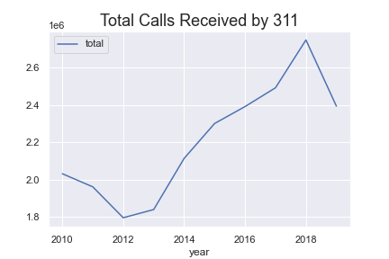

HPD is seeking help to manage the large volume of complaints by focusing on the most pressing complaint and determine the possibility of the complaints. This analysis provides insight into the trends of the complaint received by HPD.

We also investigate the relationship between building characteristics with the complaint type of our focus.

### Goal

1. Predict whether a building will have a heat complaint at a certain time
during a day on a certain month, given its characteristics
2. Determine total heat complaint in the particular area to decide which area needs more attention

### Datasets Used

1. NYC 311 Service Requests

    - original source from [NYC OpenData](https://data.cityofnewyork.us/Social-Services/311-Service-Requests-from-2010-to-Present/erm2-nwe9)

    - data only related to HPD ([2.37 GB](https://cf-courses-data.s3.us.cloud-object-storage.appdomain.cloud/IBMDeveloperSkillsNetwork-DS0720EN-SkillsNetwork/labs/Module%201/data/311_Service_Requests_from_2010_to_Present_min.csv))

2. PLUTO Dataset
    - The Primary Land Use Tax Lot Output by NYC Department of City Planning ([download here](https://www1.nyc.gov/site/planning/data-maps/open-data/dwn-pluto-mappluto.page))

## Flask Dashboard

(Update 210312) This dashboard is no longer running on PYAW, moved to [Heroku](https://nyc311-azka.herokuapp.com/)

(Update 210226) This dashboard is now running live on [PythonAnywhere](http://azukacchi.pythonanywhere.com/). Setting up Flask on PythonAnywhere tutorial [here](https://help.pythonanywhere.com/pages/Flask/).

Template by [bootstrapious](https://bootstrapious.com/p/agency-portfolio-theme) 

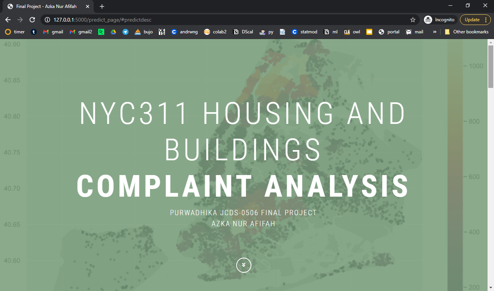

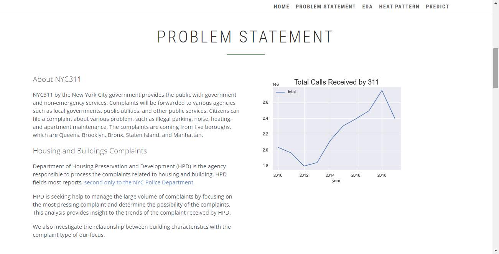

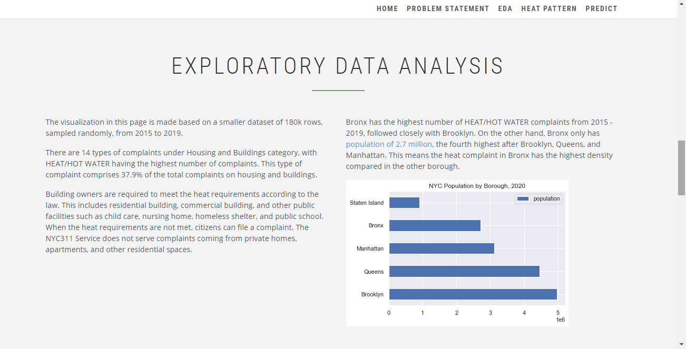

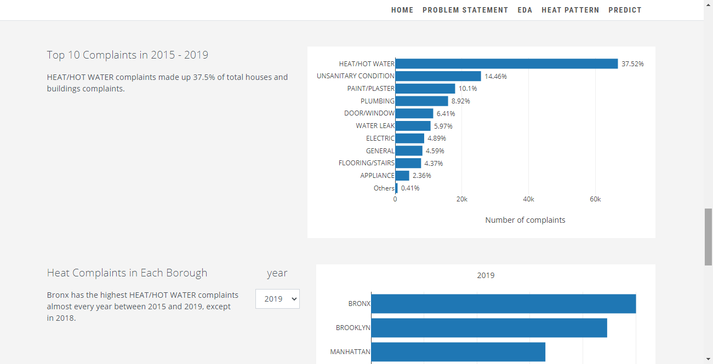

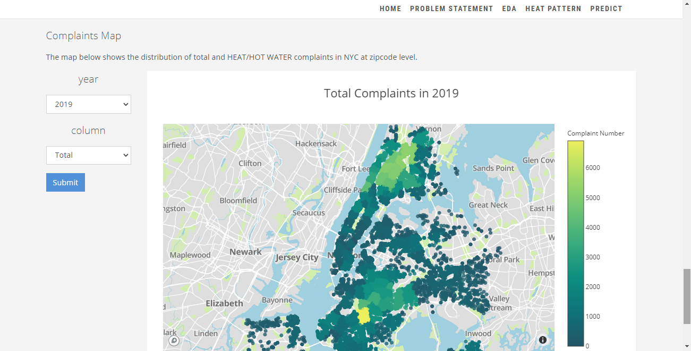

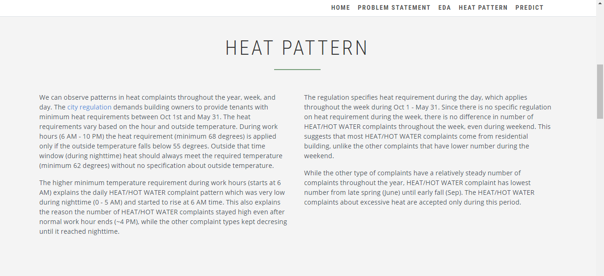

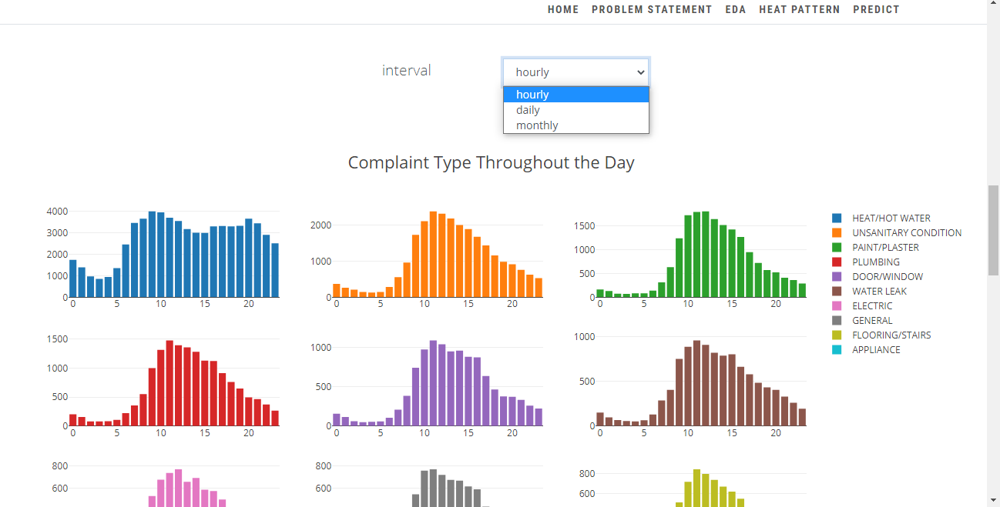

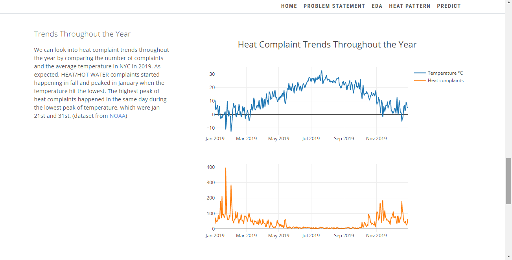

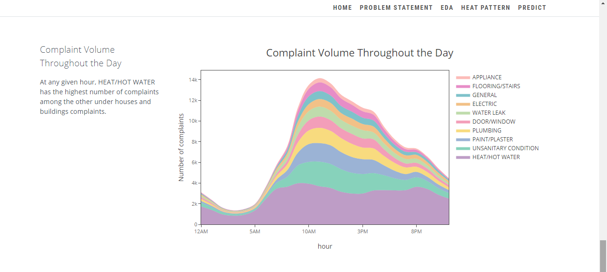

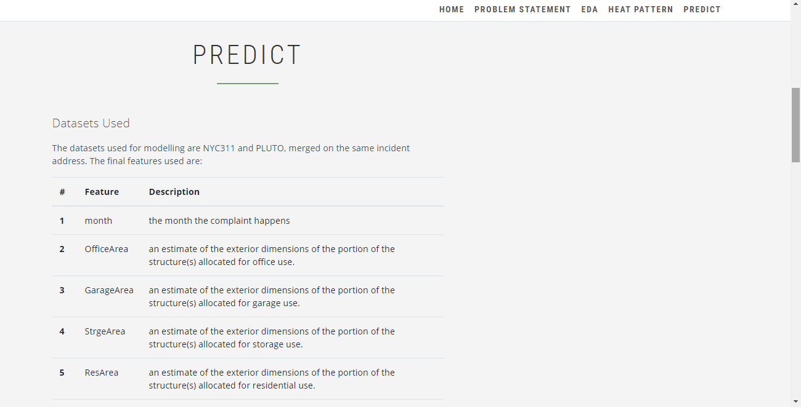

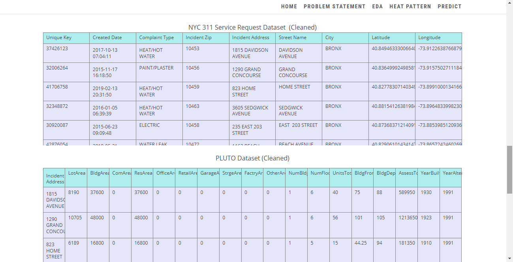

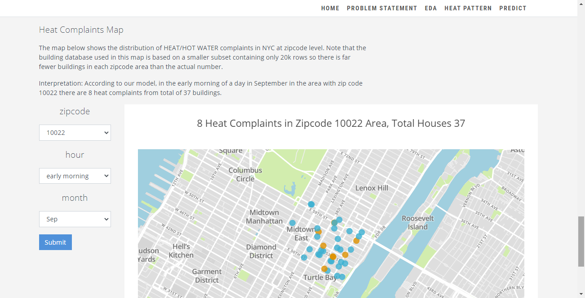

### Note

Large datasets uploaded [here](https://drive.google.com/drive/folders/1wywB_cnBPbZ1pFbjTuOzlhFfQePWcr3S?usp=sharing)

